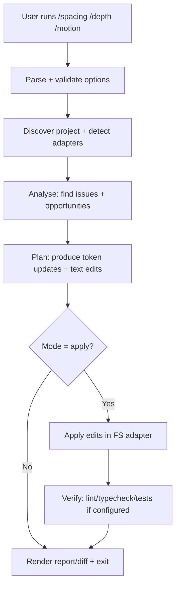
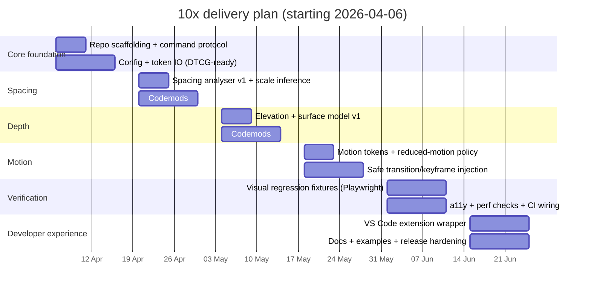

# Building 10x

## Executive summary

**10x** is a TypeScript-first “UI upgrade engine” that runs three slash commands — `/spacing`, `/depth`, and `/motion` — against a codebase (or a selected set of files/components) to **analyse**, **propose**, and optionally **apply** UI improvements. The behaviour of each command is grounded in the three reference videos: **spacing** (grouping and consistent increments), **depth** (layering via colour and shadow), and **motion** (practical web animation using the CSS `animation` shorthand). citeturn2search1turn15search1turn5view2

The plan below treats “apply UI improvements” as a software problem with two hard constraints:

1. **Edits must be safe and reviewable**: every command produces a structured report and a deterministic patch (unified diff and/or editor text edits). “Auto-apply” is always optional, can be scope-limited, and is guarded by validation steps (lint, typecheck, visual checks where available).
2. **Improvements must generalise beyond a single framework**: 10x uses a core analysis+codemod pipeline, then plugs in framework adapters (React/Tailwind/CSS Modules/etc.) via well-defined interfaces.

This is not a “magic design button”. If the underlying UI is conceptually confused (information architecture, copy, product choices), these commands can improve clarity and polish — but they won’t rescue poor product decisions. The design explicitly separates **mechanical** improvements (tokens, spacing rhythm, elevation consistency, motion hygiene) from **semantic** ones (what should be primary/secondary), and uses optional LLM assistance only where it’s appropriate to reason about context.

## Lessons and command behaviour mapping

### What the videos concretely teach

**Video on spacing** (The Easy Way to Pick Right Spacing): the key operational technique is to **group elements using the smallest acceptable internal spacing**, then **increase spacing between groups in consistent steps** (the video snippet explicitly suggests stepping group-to-group spacing by *one rem*). citeturn2search1  
A secondary implication is that spacing should be systematised (a repeatable scale), not eyeballed per component; this aligns with established spacing systems that use consistent increments (e.g., 8dp/4dp increments in Material guidance). citeturn19search0turn19search18

**Video on depth** (The Easy Way to Fix Boring UIs): the improvements are explicitly framed as (a) **colour layering** (3–4 shades of the same colour), (b) **combined light+dark shadows** to create realistic separation, (c) **highlighting important elements** with lighter shades and shadows, (d) **hierarchy and spacing**, and (e) **consistency across light/dark themes**. citeturn5view2  
These map cleanly to “elevation systems” and shadow/elevation tokens documented elsewhere (elevation communicates distance and shadow depth, and should be used with intent). citeturn17search2turn17search6turn17search9

**Video on motion** (The Easy Way to Do Web Animations): the visible summary snippet emphasises pragmatic web motion via the CSS `animation` property as a shorthand across multiple animation sub-properties. citeturn15search1  
To make motion “production-grade”, 10x must hard-bake accessibility and performance constraints: support reduced motion preferences, and avoid animation choices that cause layout/paint thrash. citeturn17search0turn17search1turn18search1

### Mapping table from video lessons to command behaviours

The table below makes the mapping explicit. “Primary” behaviours are directly driven by the video’s core topic; “secondary” ones are cross-cutting (because spacing affects depth, motion affects perceived spacing, etc.).

| Video lesson (concrete) | `/spacing` behaviour | `/depth` behaviour | `/motion` behaviour |
|---|---|---|---|
| **Group tightly, then space groups in consistent steps** (explicitly: step group-to-group by ~1rem) citeturn2search1 | Detect local clusters (label+value, icon+text, card sections). Enforce “intra-group tight, inter-group looser” via a spacing scale; propose/introduce spacing tokens. | Use spacing deltas to make elevation read correctly (e.g., slightly larger separation between raised surfaces and background so shadows aren’t doing all the work). | When expanding/collapsing UI, prefer opacity/transform-based reveals; avoid animating margins/gaps unless explicitly allowed (because that risks layout jank). citeturn18search1 |
| **Use 3–4 shades of a colour to create layers** citeturn5view2 | Nudge spacing to support layer boundaries (e.g., increase padding on surfaces that become “raised”). | Generate “surface layers” (canvas/surface/raised/overlay) per theme; apply background tints and borders; emit design tokens for surfaces. | Ensure motion reinforces layer changes (e.g., subtle elevation change + fade/transform) with consistent durations and easing tokens. citeturn20search0turn20search7 |
| **Combine soft and dark shadows for realism** citeturn5view2 | Avoid spacing fixes that force overuse of separators; prefer whitespace grouping first (consistent with the spacing video’s spirit). | Build a multi-stop shadow recipe per elevation level (e.g., ambient + key shadow) and apply consistently across components. This aligns with elevation-as-depth guidance. citeturn17search2turn17search12 | Animate elevation transitions carefully; if elevation changes on hover/focus, keep travel small and duration short; honour reduced-motion preferences. citeturn17search1turn17search0 |
| **Highlight important elements via lighter shades/shadows** citeturn5view2 | Improve scan paths by increasing whitespace around primary CTAs and headings (without changing layout structure). | Apply “attention layers” to primary actions (surface tint + subtle elevation + clearer focus ring) while preserving contrast constraints. citeturn17search10turn17search3 | Add micro-interactions (hover/press) to important elements using performant properties (transform/opacity). citeturn18search1turn18search13 |
| **Use CSS `animation` shorthand as the practical entrypoint** citeturn15search1 | Avoid adding motion that disguises spacing problems; spacing comes first. | Animate depth changes using tokenised durations and easing curves rather than bespoke values. citeturn20search0turn20search3 | Introduce a motion token system (durations/easing), prefer transitions for state changes, keyframes for repeating/complex patterns; generate consistent defaults. citeturn20search1turn20search2turn20search0 |
| **Support light + dark themes consistently** citeturn5view2 | Ensure spacing tokens are theme-agnostic (spacing shouldn’t diverge across themes). | Emit theme-aware depth tokens (shadows/borders/surface tints) and validate both themes (contrast, legibility). citeturn17search10turn17search6 | Ensure reduced-motion and motion tokens apply consistently across themes; animations shouldn’t become harsher in dark mode. citeturn17search1 |

## Command API and TypeScript contract

This section defines a **command protocol** that works for CLI, web, and IDE integrations. The same API drives all surfaces, so behaviour doesn’t drift.

### Core model

At the centre is a pure(ish) function:

- parse input → validate options → analyse project → propose edits → (optional) apply edits → produce report

The design uses **structured edits**, not ad-hoc string replacement, because spacing/depth/motion changes must be traceable and testable.

#### Types

```ts
export type SlashCommandName = "spacing" | "depth" | "motion";

export type OutputFormat = "report" | "diff" | "edits" | "json";

export interface CommandInvocation {
  raw: string;                 // Full input line e.g. "/spacing --apply"
  name: SlashCommandName;      // Parsed from raw
  args: Record<string, string | boolean | number | string[]>;
}

export interface ProjectRef {
  rootDir: string;
  /**
   * Optional file globs or explicit paths.
   * If undefined, command decides scope based on heuristics and config.
   */
  include?: string[];
  exclude?: string[];
}

export interface CommandContext {
  project: ProjectRef;

  fs: FileSystemPort;          // Abstract for CLI, IDE, web sandbox
  logger: LoggerPort;
  clock: () => Date;

  /**
   * Optional: used in "hybrid" mode to pick semantic priorities
   * (e.g., which element is primary CTA).
   */
  llm?: LlmPort;

  config: TenXConfigResolved;
}

export interface TenXConfigResolved {
  spacing: Required<SpacingOptions>;
  depth: Required<DepthOptions>;
  motion: Required<MotionOptions>;
  tokens: { outputPath: string; format: "css-variables" | "dtcg-json" };
  exclude: string[];
  /** Set after a successful apply operation in the current session. */
  lastApplySucceeded?: boolean;
}

export interface BaseOptions {
  scope?: {
    include?: string[];
    exclude?: string[];
  };

  mode?: "analyse" | "plan" | "apply";  // "apply" writes changes
  output?: OutputFormat;

  /**
   * Safety guardrails.
   */
  maxFilesChanged?: number;
  maxEditsPerFile?: number;
  failOnWarning?: boolean;

  /**
   * Adapter hints. These reduce guesswork and increase correctness.
   */
  framework?: "react" | "nextjs" | "vue" | "svelte" | "unknown";
  styling?: "tailwind" | "css-modules" | "css-in-js" | "vanilla-css" | "unknown";
}

export interface SpacingOptions extends BaseOptions {
  baseUnit?: "rem" | "px";
  gridStep?: 4 | 8;                 // aligns with common spacing systems citeturn19search0turn19search18
  groupStepRem?: number;            // default 1.0 inspired by the spacing video snippet citeturn2search1
  normaliseToTokens?: boolean;      // emit CSS vars or DTCG tokens
}

export interface DepthOptions extends BaseOptions {
  elevationScale?: 0 | 1 | 2 | 3 | 4 | 5;  // minimal practical tiers, mapped to tokens
  shadowStyle?: "material-like" | "soft-ui" | "flat";
  themeModes?: ("light" | "dark")[];
  normaliseToTokens?: boolean;
}

export interface MotionOptions extends BaseOptions {
  motionStyle?: "subtle" | "standard" | "expressive";
  respectReducedMotion?: boolean;    // default true per MDN/WCAG intent citeturn17search1turn17search0
  preferTransforms?: boolean;        // default true for performance citeturn18search1
  durationPreset?: "fast" | "medium" | "slow";
}
```

#### Results and error handling

```ts
export type Severity = "info" | "warn" | "error";

export interface Finding {
  id: string;                 // stable ID e.g. "spacing.inconsistent-scale"
  severity: Severity;
  message: string;
  file?: string;
  range?:
    | { type: "byte-offset"; start: number; end: number }
    | { type: "position"; startLine: number; startCol: number; endLine: number; endCol: number };
  data?: Record<string, unknown>;
}

export interface TextEdit {
  file: string;
  range:
    | { type: "byte-offset"; start: number; end: number }
    | { type: "position"; startLine: number; startCol: number; endLine: number; endCol: number };
  replacement: string;
}

export interface PatchPlan {
  edits: TextEdit[];
  summary: {
    filesTouched: number;
    editCount: number;
    estimatedRisk: "low" | "medium" | "high";
  };
}

export interface CommandReport {
  command: SlashCommandName;
  options: Record<string, unknown>;
  findings: Finding[];
  plan?: PatchPlan;
  notes: string[];
  metrics?: Record<string, number>;
}

export type CommandResult =
  | { ok: true; report: CommandReport; diff?: string; applied?: boolean }
  | { ok: false; error: TenXError; report?: CommandReport };

export class TenXError extends Error {
  public readonly code:
    | "INVALID_OPTIONS"
    | "UNSUPPORTED_PROJECT"
    | "SCOPE_TOO_LARGE"
    | "UNSAFE_EDIT"
    | "APPLY_FAILED"
    | "LLM_FAILED";

  public readonly details?: Record<string, unknown>;

  constructor(code: TenXError["code"], message: string, details?: Record<string, unknown>) {
    super(message);
    this.code = code;
    this.details = details;
  }
}
```

This error design is intentionally boring: it’s predictable for CLI exit codes, IDE popups, and web responses, and it prevents the “stringly-typed” failure modes that make tooling painful.

### Validation strategy

10x should validate inputs at two layers:

- **TypeScript compile-time** (developer ergonomics)
- **Runtime schema validation** (user input, CLI flags, editor UI)

A practical approach is to define a single runtime schema (e.g., Zod/Valibot/TypeBox) and infer TS types from it; the exact library choice is open-ended, but the *behaviour* is not: invalid inputs must fail fast with actionable messaging.

## Architecture and module breakdown

### Overview

10x is easiest to keep maintainable as a **core engine + adapters** system:

- **Core**: command parsing, option validation, analysis pipeline, codemod planning, patch application, reporting.
- **Adapters**: project discovery, framework/styling recognition, AST parsing and transformations specific to CSS/TSX/etc.
- **Optional AI**: used only to disambiguate semantics (e.g., “which button is primary?”), not to rewrite arbitrary code without guardrails.

This is consistent with how modern agentic coding tools and tool-use systems are described: tools expose clear capabilities, with an execution loop managed outside the tool itself. citeturn16search4turn16search0

### Module layout

A realistic monorepo breakdown:

| Package | Responsibilities | Notes |
|---|---|---|
| `@10x/core` | Command protocol, pipeline orchestration, patch planning, report schema | Must be framework-agnostic. |
| `@10x/analyse-spacing` | Spacing heuristics, spacing scale detection, grouping inference | Incorporates “group tight → step groups” logic from the spacing video. citeturn2search1 |
| `@10x/analyse-depth` | Elevation roles, shadow/tint generation, theme checks | Encodes “3–4 shades + light/dark shadow + theme consistency”. citeturn5view2turn17search2 |
| `@10x/analyse-motion` | Motion token generation, transition injection rules, reduced-motion policy | Encodes `prefers-reduced-motion` support and performance constraints. citeturn17search1turn18search1 |
| `@10x/codemods-css` | PostCSS pipeline: read/transform/write CSS | Enables tokenisation of spacing/elevation/motion. |
| `@10x/codemods-tsx` | TS/TSX transformations (TypeScript compiler API or ts-morph) | Used for className edits, style object edits, etc. |
| `@10x/tokens` | Token model, token IO, DTCG format export/import | DTCG format is a credible interoperability target. citeturn19search2turn19search10 |
| `@10x/cli` | CLI entrypoint, config resolution, printing reports/diffs | “Slash commands” can be accepted as raw strings for parity with editors. |
| `@10x/vscode` | VS Code extension wrapper: run commands on selection, show diffs | Optional but high-leverage. |
| `@10x/mcp-server` | Expose 10x commands as MCP tools | MCP is explicitly designed for connecting LLM apps to tools. citeturn16search3turn16search15 |

### State and configuration

Configuration needs to be explicit and versioned because spacing/depth/motion systems are part of a design language.

Recommended config approach:

- A root `10x.config.json` (or `.ts` if you want typed config) with:
  - detected framework/styling overrides
  - token output path(s)
  - theme modes
  - “do not touch” patterns (vendor code, generated files)
  - motion accessibility policy default (reduced motion on)

Token output should support the **Design Tokens Community Group** format (stable spec release 2025.10), so 10x isn’t inventing a proprietary token schema. citeturn19search2turn19search10

### Delivery surfaces

10x should start as a CLI because it forces discipline (deterministic inputs/outputs) and is easiest to test. Then expand into IDE and web.

| Surface | Strengths | Risks / Costs |
|---|---|---|
| CLI (`npx 10x "/spacing …"`) | Deterministic, works in CI, easiest distribution | Needs good UX to avoid being “too dev-y”. |
| IDE plugin | Fast feedback, apply to selection, readable diffs | Extension maintenance, editor API churn. |
| Web app | Easy onboarding, can generate PRs | Requires sandboxing, auth, security review. |

### Integration with Claude Code and other LLMs

There are two practical integration patterns:

1. **Tool server pattern (MCP)**: 10x runs as a local MCP server exposing tools like `tenx_spacing_analyse` / `tenx_depth_apply`. MCP is explicitly intended to standardise tool/data connectivity for LLM applications. citeturn16search3turn16search15  
   This matches how “agentic coding tools” operate: they call external tools, then interpret results. Claude Code is described as an agentic tool that can read/edit files and integrate with dev tooling. citeturn16search0

2. **LLM-client pattern**: 10x calls an LLM API directly (optional feature), passing constrained context and requesting *structured* output. Both Anthropic’s tool-use docs and OpenAI’s Responses API emphasise structured tool/function calling and stateful interactions as first-class. citeturn16search4turn16search2turn16search14

The design should support both because teams vary: some want *no network calls*; others want “hybrid” assistance for harder semantic judgements.

### Pipeline diagram



This “analyse → plan → apply → verify” structure is what keeps the tool honest: it’s the difference between a code mod and an unreliable rewrite.

## Implementation approach and core TypeScript snippets

The goal here is not a full implementation, but the core building blocks that make 10x real.

### Parsing slash commands

```ts
export function parseSlashCommand(raw: string): CommandInvocation {
  const trimmed = raw.trim();
  if (!trimmed.startsWith("/")) {
    throw new TenXError("INVALID_OPTIONS", "Command must start with '/'");
  }

  const [head, ...rest] = tokenize(trimmed);
  const name = head.slice(1) as SlashCommandName;

  if (!["spacing", "depth", "motion"].includes(name)) {
    throw new TenXError("INVALID_OPTIONS", `Unknown command: ${head}`);
  }

  const args = parseFlags(rest);
  return { raw: trimmed, name, args };
}

// Minimal tokenizer that respects quotes.
function tokenize(input: string): string[] {
  const out: string[] = [];
  let buf = "";
  let quote: "'" | '"' | null = null;

  for (const ch of input) {
    if ((ch === "'" || ch === '"') && quote === null) { quote = ch; continue; }
    if (ch === quote) { quote = null; continue; }
    if (!quote && /\s/.test(ch)) {
      if (buf) out.push(buf), (buf = "");
      continue;
    }
    buf += ch;
  }
  if (buf) out.push(buf);
  return out;
}

function parseFlags(tokens: string[]): Record<string, string | boolean | number | string[]> {
  const args: Record<string, any> = {};
  for (let i = 0; i < tokens.length; i++) {
    const t = tokens[i];
    if (!t.startsWith("--")) continue;

    const [k, vInline] = t.slice(2).split("=");

    // boolean flag: --apply (no value follows, or next token is another flag)
    if (vInline === undefined && (i + 1 >= tokens.length || tokens[i + 1].startsWith("--"))) {
      args[k] = true;
      continue;
    }

    const v = vInline ?? tokens[++i];

    // naive number coercion
    const num = Number(v);
    args[k] = Number.isFinite(num) && String(num) === String(v) ? num : v;
  }
  return args;
}
```

### Command execution skeleton

```ts
export async function executeTenXCommand(
  inv: CommandInvocation,
  ctx: CommandContext
): Promise<CommandResult> {
  try {
    const report = await route(inv, ctx);
    const wasApplied = (report.plan?.edits?.length ?? 0) > 0 && inv.args.mode === "apply";
    return { ok: true, report, diff: renderDiffIfRequested(report, ctx), applied: wasApplied };
  } catch (err) {
    const error = err instanceof TenXError
      ? err
      : new TenXError("APPLY_FAILED", "Unexpected failure", { cause: String(err) });

    return { ok: false, error };
  }
}

async function route(inv: CommandInvocation, ctx: CommandContext): Promise<CommandReport> {
  switch (inv.name) {
    case "spacing": return runSpacing(inv, ctx);
    case "depth":   return runDepth(inv, ctx);
    case "motion":  return runMotion(inv, ctx);
  }
}
```

### Spacing analysis concept

A pragmatic “v1” spacing analyser does three things:

1. **Collect spacing values** used across CSS and inline styles (padding, margin, gap, row-gap, column-gap).
2. **Cluster them** to infer a scale (e.g., 4/8-based, rem-based).
3. **Spot inconsistencies** (nearly-equal values like 14px vs 16px; arbitrary one-offs).

The crucial behavioural rule inspired by the spacing video is: **within groups: tighter; between groups: step up by a consistent increment**. citeturn2search1

```ts
export interface SpacingScale {
  unit: "px" | "rem";
  steps: number[];          // e.g. [4,8,12,16,24,32] in px
  confidence: number;       // 0..1
}

export function inferSpacingScale(valuesPx: number[]): SpacingScale {
  const sorted = [...new Set(valuesPx.filter(v => v > 0))].sort((a, b) => a - b);

  if (sorted.length < 2) {
    return { unit: "px", steps: sorted, confidence: 0.1 };
  }

  const diffs = [];
  for (let i = 1; i < sorted.length; i++) diffs.push(sorted[i] - sorted[i - 1]);

  const step = mostCommon(diffs.map(d => nearest([4, 8], d)));
  if (step <= 0) {
    return { unit: "px", steps: sorted, confidence: 0.1 };
  }
  const max = sorted.reduce((a, b) => Math.max(a, b), sorted[0] ?? 0);
  const steps = buildSteps(step, max);

  return {
    unit: "px",
    steps,
    confidence: step > 0 ? 0.6 : 0.2
  };
}

function nearest(candidates: number[], x: number): number {
  return candidates.reduce((best, c) => Math.abs(c - x) < Math.abs(best - x) ? c : best, candidates[0]);
}
function buildSteps(step: number, max: number): number[] {
  const out: number[] = [];
  for (let v = step; v <= max; v += step) out.push(v);
  return out;
}
function mostCommon(xs: number[]): number {
  const m = new Map<number, number>();
  for (const x of xs) m.set(x, (m.get(x) ?? 0) + 1);
  return [...m.entries()].sort((a, b) => b[1] - a[1])[0]?.[0] ?? 0;
}
```

This is intentionally basic; the point is to structure the engine so smarter heuristics can replace it without rewriting everything.

### Depth token generation concept

The depth video pushes “layering” and “shadow realism” using multiple shades and combined shadows. citeturn5view2  
Material’s documentation frames elevation as a depth measure that maps to shadow appearance. citeturn17search2

A token-driven depth system (light + dark shadow components, role-based elevations) is the sensible software analogue:

```ts
export interface ElevationToken {
  level: number;                 // 0..5 (in 10x-tiered scale)
  shadow: string;                // CSS box-shadow string (possibly multi-layer)
  surfaceDelta: number;          // how much to tint surface relative to base (L* or %)
}

export function buildElevationScale(kind: "material-like" | "soft-ui"): ElevationToken[] {
  if (kind === "material-like") {
    return [
      { level: 0, shadow: "none", surfaceDelta: 0 },
      { level: 1, shadow: "0 1px 2px rgba(0,0,0,.12), 0 1px 1px rgba(0,0,0,.08)", surfaceDelta: 1 },
      { level: 2, shadow: "0 2px 6px rgba(0,0,0,.14), 0 2px 2px rgba(0,0,0,.10)", surfaceDelta: 2 },
      { level: 3, shadow: "0 6px 18px rgba(0,0,0,.16), 0 3px 6px rgba(0,0,0,.10)", surfaceDelta: 3 },
      { level: 4, shadow: "0 10px 30px rgba(0,0,0,.18), 0 6px 10px rgba(0,0,0,.10)", surfaceDelta: 4 },
      { level: 5, shadow: "0 16px 48px rgba(0,0,0,.20), 0 10px 16px rgba(0,0,0,.12)", surfaceDelta: 5 },
    ];
  }

  // "soft-ui" variant would use subtler shadows and more borders.
  return [
    { level: 0, shadow: "none", surfaceDelta: 0 },
    { level: 1, shadow: "0 1px 3px rgba(0,0,0,.08)", surfaceDelta: 1 },
    { level: 2, shadow: "0 4px 10px rgba(0,0,0,.10)", surfaceDelta: 2 },
    { level: 3, shadow: "0 8px 20px rgba(0,0,0,.12)", surfaceDelta: 3 },
    { level: 4, shadow: "0 12px 30px rgba(0,0,0,.14)", surfaceDelta: 4 },
    { level: 5, shadow: "0 18px 48px rgba(0,0,0,.16)", surfaceDelta: 5 },
  ];
}
```

In a production implementation, you’d compute theme-aware variants rather than fixed RGBA strings (because dark themes often need different techniques: borders/glows/tints rather than heavy black shadows). The depth video explicitly calls out consistency across light/dark themes as a requirement. citeturn5view2

### Motion injection concept

Motion must be both **human-feeling** (easing/duration discipline) and **safe** (reduced-motion support) and **fast** (avoid layout/paint-triggering properties). citeturn20search0turn17search1turn18search1

```ts
export interface MotionTokens {
  durationFastMs: number;
  durationMidMs: number;
  durationSlowMs: number;
  easingStandard: string;     // cubic-bezier(...)
}

export function defaultMotionTokens(preset: "fast" | "medium" | "slow"): MotionTokens {
  // Baseline inspired by common motion guidance (durations + easing discipline). citeturn20search0turn20search3
  if (preset === "fast")   return { durationFastMs: 90,  durationMidMs: 140, durationSlowMs: 200, easingStandard: "cubic-bezier(.2,0,0,1)" };
  if (preset === "slow")   return { durationFastMs: 140, durationMidMs: 220, durationSlowMs: 320, easingStandard: "cubic-bezier(.2,0,0,1)" };
  return { durationFastMs: 120, durationMidMs: 180, durationSlowMs: 260, easingStandard: "cubic-bezier(.2,0,0,1)" };
}

export function reducedMotionCss(): string {
  // MDN: prefers-reduced-motion signals user preference to minimise non-essential motion. citeturn17search1
  return `
@media (prefers-reduced-motion: reduce) {
  *, *::before, *::after {
    animation-duration: .001ms !important;
    animation-iteration-count: 1 !important;
    transition-duration: .001ms !important;
    scroll-behavior: auto !important;
  }
}`;
}
```

This is the bare minimum. WCAG’s “Animation from Interactions” intent is that motion triggered by interaction can be disabled unless essential. citeturn17search0turn17search10  
The implementation should therefore support either:

- automatic respect of OS preference (`prefers-reduced-motion`), and/or
- an explicit in-app toggle, depending on product requirements. citeturn17search0turn17search7

## Quality, accessibility, and performance strategy

### Testing strategy

A tooling product that edits code needs defence-in-depth. The minimum credible test pyramid:

| Layer | What to test | Tools (examples) |
|---|---|---|
| Unit | Option parsing, schema validation, scale inference, token generation | Vitest/Jest |
| Codemod unit | Given input file → exact output file (“golden” tests) | fixtures + snapshot diffs |
| Integration | Run command on a fixture repo; ensure diffs compile | Node runner + TypeScript build |
| Visual regression | Before/after screenshots for key pages/components | Playwright |
| Accessibility regression | Detect contrast, focusability, reduced-motion behaviour | axe-core + custom checks |
| Performance regression | Ensure motion does not introduce layout-thrashing patterns | Lighthouse/DevTools traces heuristic checks |

The performance and motion sources matter operationally: high-performance motion strongly prefers animating `transform` and `opacity`, avoiding properties that trigger layout or paint. citeturn18search1turn18search7  
Also, `will-change` is a last resort and can be harmful if overused, so 10x should not spray it everywhere. citeturn18search2

### UX validation scenarios

Because 10x edits are meant to improve “feel” (not just code cleanliness), validation should include **real tasks** and **perception checks**:

- **Spacing scenario**: A dense settings page with multiple form groups. Run `/spacing --mode=apply --scope=...` and validate:
  - visually, users can identify sections faster (“grouping reads instantly”),
  - form groups maintain minimum touch target logic (don’t compress controls into unusable clusters),
  - spacing stays consistent across responsive breakpoints (no random 14/18/22 px drift).
  Material explicitly documents spacing methods and increments (8dp/4dp), which makes this measurable. citeturn19search0turn19search18

- **Depth scenario**: A dashboard with cards, modals, sticky headers. Run `/depth` and validate:
  - overlays read as overlays,
  - elevation is role-based (modals > dropdowns > cards),
  - light and dark themes both remain coherent (no “muddy” shadows, no glowing noise).
  Depth-as-elevation interpretation is grounded in elevation/shadow guidance. citeturn17search2turn17search6turn5view2

- **Motion scenario**: Buttons, menus, accordions, route transitions. Run `/motion` and validate:
  - motion guides attention rather than distracts (short, consistent durations and easing),
  - reduced-motion mode meaningfully disables interaction-triggered motion (not just “slower jank”),
  - animations remain smooth on low-end devices (no layout thrash).
  Motion performance and reduced-motion guidance are explicit in web.dev, WCAG explanations, and MDN. citeturn18search1turn17search0turn17search1

### Accessibility commitments

A credible baseline for 10x is:

- Always emit reduced-motion support (on by default), because the platform signal exists specifically for minimising non-essential motion. citeturn17search1
- Treat interaction-triggered motion as optional unless essential, consistent with WCAG’s “Animation from Interactions” criterion explanation. citeturn17search0turn17search10
- Avoid “depth” and “motion” changes that reduce legibility or contrast; WCAG 2.2 is the umbrella reference for accessibility requirements. citeturn17search10

## Rollout, versioning, and delivery plan

### Versioning model

Use SemVer for the CLI/library, but additionally version the **command output schema** because downstream tooling (IDE extension, CI, dashboards) will depend on it.

- `10x` CLI version: `MAJOR.MINOR.PATCH`
- `CommandReport.schemaVersion`: e.g. `"2026-04-01"` or `"1.0"`

Breaking changes should be rare and deliberate:
- breaking report schema → major bump
- new findings / new token keys → minor bump
- bugfixes / heuristics tuning → patch bump

### Command maturity stages

Each command should ship through explicit maturity levels:

- **alpha**: analyse-only, no auto-apply
- **beta**: apply under strict guardrails + limited adapters
- **stable**: apply with broader adapter support + visual regression hooks

This matters because codemods can destroy trust quickly if they make sloppy edits.

### Recommended initial scope and trade-offs

A realistic first stable target is **web UI codebases** where CSS exists in one of these forms:

- CSS files (vanilla, modules)
- Tailwind utility classes (limited safe transforms)
- CSS-in-JS (harder; don’t start here unless you must)

Token strategy: adopt DTCG token format for interoperability and to avoid inventing yet another token file structure. citeturn19search2turn19search10

### LLM usage guardrails

If you integrate LLMs, do it in a way that keeps the tool deterministic:

- LLM proposes a *plan* (structured), not raw code edits.
- 10x converts plan into edits using codemods where possible.
- 10x validates output via compilation/tests.
- LLM never gets full repo context by default; scope is explicitly user-controlled.

This aligns with tool-use patterns, where the model selects tools and returns structured calls, and the application executes them. citeturn16search4turn16search2

## Effort estimate and timeline

### Assumptions

- Team: **1 senior TypeScript engineer + 1 part-time design-minded reviewer** (or a second engineer for speed).
- Target: CLI-first, with a minimal VS Code extension wrapper after core stabilises.
- Start date: **Monday 6 April 2026** (next Monday after today in Africa/Harare).

### Milestones

| Milestone | Deliverable | Time |
|---|---|---|
| Foundational core | Command protocol, config, report schema, patch engine | 2 weeks |
| `/spacing` v1 | Analyse+plan+apply for CSS + basic TSX | 2 weeks |
| `/depth` v1 | Elevation + surface tokens; apply to common patterns | 2 weeks |
| `/motion` v1 | Motion tokens, reduced-motion CSS, safe transitions | 2 weeks |
| Verification harness | Visual/a11y/perf hooks in CI for fixture apps | 2 weeks |
| IDE wrapper | VS Code extension that runs commands + shows diff | 2 weeks |

Total: **12 weeks (6 sprints)** for an MVP that’s actually usable and trustworthy.

### Sprint timeline



### Where the hard parts really are

- **Tailwind & className rewriting**: safe transforms are possible, but it’s easy to break responsive variants and arbitrary values. Start with reporting, then apply only when confidence is high.
- **Depth across themes**: the depth video explicitly calls for light/dark consistency; doing that well often requires theme-aware token logic rather than naïve `box-shadow` copying. citeturn5view2
- **Motion accessibility and performance**: you must respect reduced-motion preferences and avoid janky properties; the web platform guidance is explicit, and users will notice when you ignore it. citeturn17search1turn18search1

### Recommended “v1” approach choices

A practical comparison for the transformation engine:

| Approach | What it looks like | Pros | Cons |
|---|---|---|---|
| Rule-only codemods | AST-based edits, no LLM | Deterministic, CI-friendly, safe by default | Can’t infer semantics well (what is “primary”?) |
| LLM-only rewrite | Prompt + rewrite files | Fast to prototype, can reason semantically | Unreliable diffs, hard to test, harder to trust |
| Hybrid (recommended) | Rules for mechanical edits + constrained LLM for semantic hints | Best balance: safe edits + smarter prioritisation | Requires guardrails and good interfaces |

The “hybrid” choice also aligns with modern tool-use APIs: LLMs are strongest when they can call tools and return structured outputs, not when they are asked to freestyle refactors. citeturn16search4turn16search2

---

**Entity references used:** entity["movie","The Easy Way to Pick Right Spacing","youtube video -O1ds-kPUZg"] entity["movie","The Easy Way to Fix Boring UIs","youtube video wcZ6jSlZqDc"] entity["movie","The Easy Way to Do Web Animations","youtube video hZh-CiPt91w"] entity["people","Sajid","youtube creator whosajid"] entity["company","Anthropic","ai company"] entity["company","OpenAI","ai company"] entity["organization","W3C","web standards body"] entity["company","Apple","consumer electronics company"] entity["organization","Mozilla","internet non-profit"]